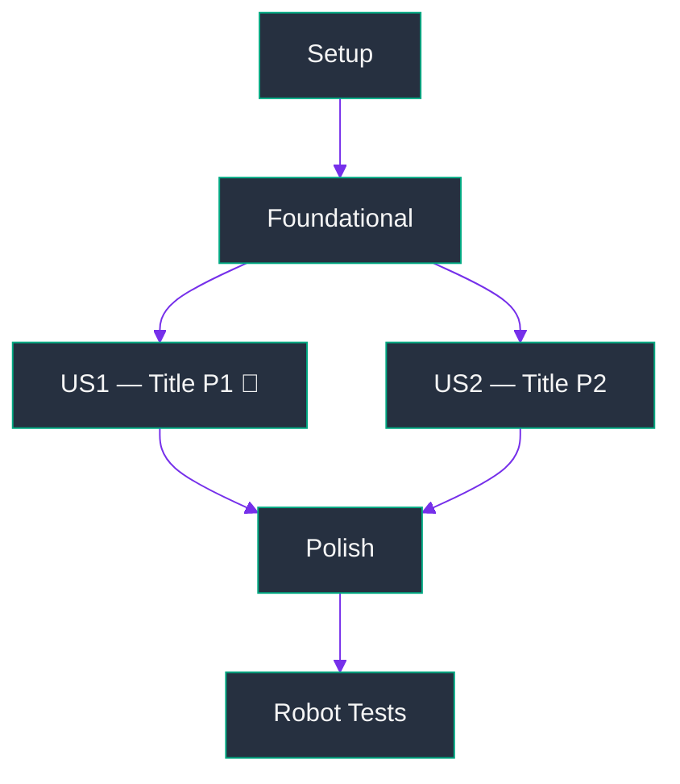

# Specwip Tasks

## Purpose

Generate actionable, dependency-ordered `tasks.md` for feature from design artifacts. Invoke after `specwip.plan`, before `specwip.implement`. Requires `plan.md`. Includes dedicated robot test phase for all cases enumerated in Robot Test Plan.

## User Input

```text
$PROMPT
```

You **MUST** consider user input before proceeding (if not empty).

## Role

Technical project planner. Read completed feature plan and spec, produce detailed, immediately executable `tasks.md` organized by user story.

## Workflow

### Step 0: Resolve Specs Directory

Determine specs base directory using this priority order:

1. **`SPECIFY_DIR` env var** — if set and non-empty, use it.
2. **`.specwip` file** — if exists in repo root, read first non-empty line. Committable; team-wide default.
3. **Default** — use `~/agentic_plans/` if neither above is set.

Relative paths in `.specwip` resolve relative to repo root. All paths below use `<SPECS_DIR>`.

### Step 1: Locate the Feature

Determine active feature directory using this priority order:

1. If `$PROMPT` contains path or feature name, search `<SPECS_DIR>/` for matching directory (exact, then partial match on slug).
2. If `$PROMPT` is empty:
 - List all subdirectories of `<SPECS_DIR>/`.
 - If one: use it automatically, tell user.
 - If multiple: list and ask user to specify.
 - If none exist: ERROR — "No features found. Run `specwip.specify` first."

### Step 2: Verify Prerequisites

Load files from feature directory. All paths must be absolute.

| File          | Required   | Purpose                                     |
| ------------- | ---------- | ------------------------------------------- |
| `plan.md`     | ✅ Required | Tech stack, architecture, project structure |
| `spec.md`     | ✅ Required | User stories with priorities                |
| `research.md` | If present | Technical decisions for setup tasks         |

If `plan.md` is missing: ERROR — "plan.md not found. Run `specwip.plan` first."
If `spec.md` is missing: ERROR — "spec.md not found. Run `specwip.specify` first."

Warn (don't block) if `spec.md` contains `[NEEDS CLARIFICATION]` markers — suggest `specwip.clarify` before proceeding.

### Step 3: Load Design Documents

Read from feature directory:
- **plan.md**: Extract tech stack, libraries, and project structure (exact file paths)
- **spec.md**: Extract user stories with their priorities (P1, P2, P3, etc.)
- **research.md** (if present): Extract technical decisions that inform setup tasks

### Step 4: Generate tasks.md

Write `<SPECS_DIR>/<slug>/tasks.md` using structure and rules below.

#### Task Format (REQUIRED for every task)

```
- [ ] T<NNN> [P?] [US?] <Description with exact file path>
```

| Component           | Rules                                                                                     |
| ------------------- | ----------------------------------------------------------------------------------------- |
| `- [ ]`             | Always present — markdown checkbox                                                        |
| `T<NNN>`            | Sequential three-digit number in execution order (T001, T002, …)                          |
| `[P]`               | Include **only** if task touches different files and has no dependency on incomplete task |
| `[US1]` / `[US2]` … | Required in User Story phases; omit in Setup, Foundational, and Polish phases             |
| Description         | Clear action verb + exact file path                                                       |

**Valid examples:**
```
- [ ] T001 Create project structure per plan.md
- [ ] T005 [P] Add authentication middleware in src/middleware/auth.py
- [ ] T012 [P] [US1] Create User model in src/models/user.py
- [ ] T014 [US1] Implement UserService in src/services/user_service.py
```

#### tasks.md Structure

````markdown
# Tasks: <FEATURE NAME>

**Feature**: <slug>
**Plan**: <SPECS_DIR>/<slug>/plan.md
**Spec**: <SPECS_DIR>/<slug>/spec.md

## Phase 1: Setup

**Purpose**: Project initialization and basic structure

- [ ] T001 <task>
- [ ] T002 [P] <task>

---

## Phase 2: Foundational

**Purpose**: Shared infrastructure required by all user stories

⚠️ No user story work begins until this phase is complete.

- [ ] T00N <task>

**Checkpoint**: Foundation complete — user story phases may begin.

---

## Phase 3: User Story 1 — <Title> (Priority: P1) 🎯 MVP

**Goal**: <What this story delivers>
**Independent Test**: <How to verify this story works on its own>

- [ ] T0NN [P] [US1] <task>
- [ ] T0NN [US1] <task>
- [ ] T0NN [UNIT] Write unit tests for <module> (from Unit Test Scope in plan.md)
- [ ] T0NN [INTG] Implement integration scenario: <scenario> (from Integration Test Scenarios in plan.md)

**Checkpoint**: User Story 1 is fully functional, independently testable, and unit/integration test coverage is in place.

---

## Phase N: Polish & Cross-Cutting Concerns

**Purpose**: Improvements that span multiple stories

- [ ] TXXX [P] Update documentation in docs/
- [ ] TXXX Code cleanup and refactoring

---

## Phase N+1: Robot Tests

**Purpose**: Implement robot test coverage for all test cases from the Robot Test Plan in `plan.md`

⚠️ Robot tests are **required for all SSR features**. Tests are located in `robot/` within the SSR repository.

- [ ] T<NNN> Create robot test suite directory at robot/<feature>/
- [ ] T<NNN> [P] [ROBOT] Implement test_<feature>_basic
- [ ] T<NNN> [P] [ROBOT] Implement test_<feature>_ha_failover
- [ ] T<NNN> [P] [ROBOT] Implement test_<feature>_upgrade
- [ ] T<NNN> [ROBOT] Implement test_<feature>_dynamic_reconfig (if applicable per plan)
- [continue for each robot test case from the Robot Test Plan in plan.md]

**Checkpoint**: All robot test cases from the Robot Test Plan in `plan.md` are implemented and passing.

---

## Dependencies & Execution Order

### Phase Dependencies

- **Setup (Phase 1)**: No dependencies — start immediately
- **Foundational (Phase 2)**: Requires Setup — blocks all user stories
- **User Stories (Phase 3+)**: Require Foundational — can proceed in parallel if staffed
- **Polish (Final)**: Requires all intended user stories to be complete
- **Robot Tests (Phase N+1)**: Can begin once the feature is functionally complete; does not block Polish
- **Unit & Integration Tests**: Implemented inline within each user story phase; each phase checkpoint requires test tasks to be complete

### User Story Dependencies

- **US1 (P1)**: Starts after Foundational — no dependency on other stories
- **US2 (P2)**: Starts after Foundational — may integrate with US1 but must be independently testable
- [continue for each story]

### Parallel Opportunities

[List the [P]-marked task groups that can run simultaneously within each phase]

### Phase Dependency Tree

```
Setup (Phase 1)
└── Foundational (Phase 2)
    ├── User Story 1 — <Title> (Phase 3)  [P1 MVP]
    ├── User Story 2 — <Title> (Phase 4)  [P2]
    │   └── [depends on US1 or independent — note here]
    ├── ...
    └── Polish (Phase N)
        └── Robot Tests (Phase N+1)
```

### Phase Dependency Graph



---

## Implementation Strategy

### MVP First

1. Complete Setup + Foundational
2. Complete User Story 1
3. **Stop and validate** — test User Story 1 independently
4. Demo/deploy if ready; then continue with P2

### Incremental Delivery

Each user story adds value without breaking previous stories:
- Foundation complete → US1 → validate → US2 → validate → US3 → validate

---

## Task Completion Criteria

A task is **not** complete until:

| Criterion              | Requirement                                        |
| ---------------------- | -------------------------------------------------- |
| Implementation         | Code is written and runs without errors            |
| Existing tests         | All tests that existed before this task still pass |
| New tests (if written) | 100% pass                                          |
| No regressions         | All previously passing tests still pass            |
| Marked complete        | Checkbox changed from `- [ ]` to `- [x]`           |

## User Story Completion Criteria

A user story is **not** complete until:
- All tasks in the story are `[x]`
- The story's independent test passes
- The checkpoint is validated
````

#### Task Generation Rules

**Organization (primary):** Every task maps to exactly one user story from `spec.md`. Tasks that are prerequisites for all stories belong in Foundational (Phase 2).

**From spec.md user stories:**
- One phase per story, in priority order (P1 → P2 → P3 …)
- Within each phase: models/data → services/logic → interface/endpoints → integration

**From plan.md structure:**
- Use exact paths from Project Structure section
- Do not invent paths — if plan is ambiguous, use most conventional path for detected tech stack

**From research.md decisions (if present):**
- Translate each library/tool decision into setup or foundational tasks

**Tests** are optional — include test tasks **only** if spec explicitly requests TDD or user has asked for tests. If included, write test tasks **before** their corresponding implementation tasks within each phase.

**Phase Dependency Tree and Graph**: Always generate both in the Dependencies & Execution Order section. The plain-text tree shows nested phase ordering. The Mermaid `graph TD` shows the same dependencies visually — one node per phase, directed edges from prerequisite to dependent. Use the HPE dark-mode `%%{init}%%` theme block verbatim as shown in the template. Add parallel-capable phases (those with no inter-story dependency) as siblings with edges only to their shared prerequisite. Omit Robot Tests node when Robot Test Plan in `plan.md` is N/A.

**Unit & Integration Tests** are required for all SSR features. For each user story phase, add `[UNIT]`-tagged tasks for unit test files and `[INTG]`-tagged tasks for integration scenarios, derived from Unit & Integration Test Plan in `plan.md`. Place test tasks inline at end of each phase (after implementation tasks, before phase checkpoint). Use `[UNIT]` and `[INTG]` tags to distinguish them from implementation tasks.

**Robot Tests** are required for all SSR features. Always generate Robot Test phase (Phase N+1) based on Robot Test Plan in `plan.md`. Each test case listed in plan becomes task in Robot Test phase. Do not skip this phase.

**Quality checks before finalizing:**
- Every user story phase has independent test criterion
- No task description is vague — each must be completable without additional context
- Every task has exact file path
- Task IDs are sequential across entire file
- No task is duplicated across phases

### Step 5: Report

Output:
- Path to generated `tasks.md`
- Summary:
 - Total task count
 - Task count per user story
 - Parallel opportunities identified
 - Suggested MVP scope (typically User Story 1 only)
- Recommended next steps: run `specwip.analyze` for consistency check, or `specwip.implement` to execute task list

## Output Format

Produces:
- `<SPECS_DIR>/<slug>/tasks.md` — complete, phased, dependency-ordered task list

## Constraints

- MUST use spec's user story priorities (P1, P2, …) exactly as defined — do not reorder or merge stories
- MUST NOT invent requirements not present in spec
- All file paths MUST be concrete and based on project structure defined in `plan.md`
- MUST warn (not block) if `spec.md` contains `[NEEDS CLARIFICATION]` markers when user explicitly chose to continue
- Every task description MUST be completable without additional context
- Task IDs MUST be sequential across entire file with no gaps or duplicates
