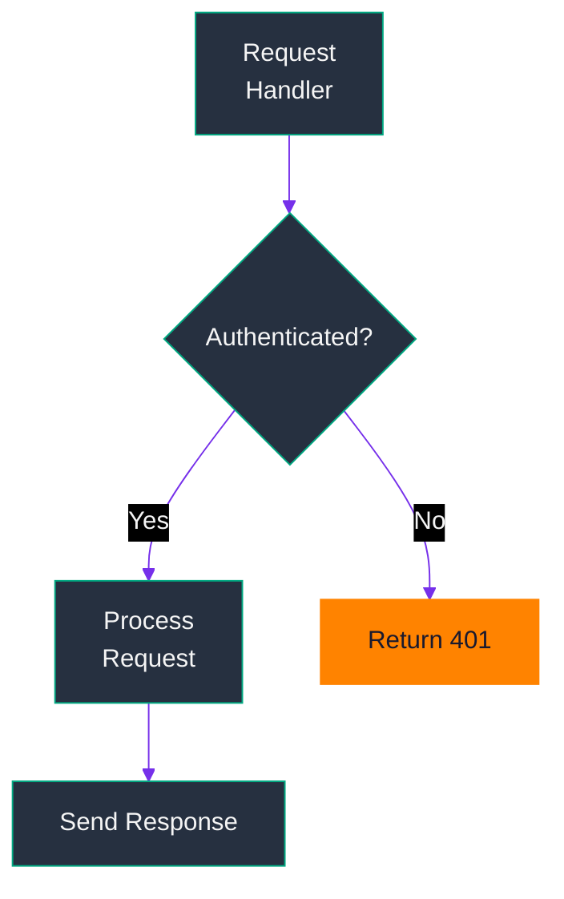
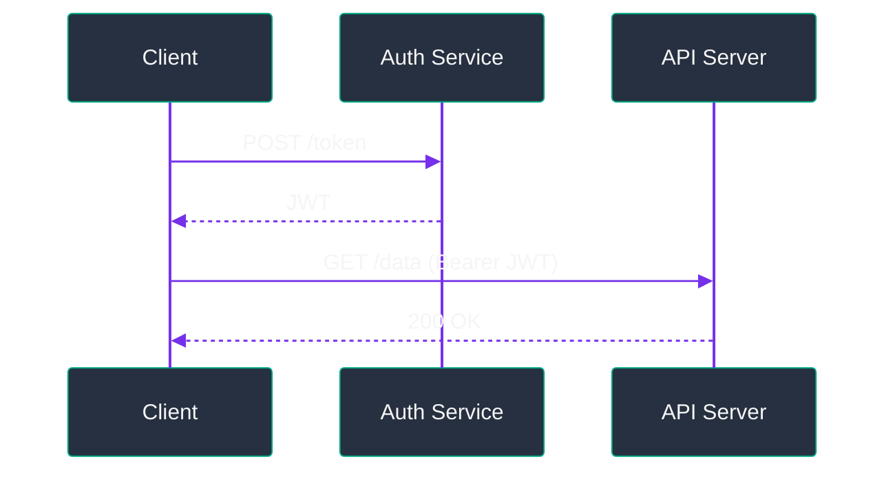

# Mermaid Diagrams

## Description

Use when generating/editing/reviewing Mermaid diagrams — flowcharts, sequence, class, ER, state, Gantt, or any visualization. Enforces HPE dark-mode theme, correct syntax, cross-viewer compat. Invoke on "draw a diagram", "create a flowchart", "make a sequence diagram", "visualize architecture".

## Core Rules

1. **Prepend HPE dark-mode theme directive** to every block (see [Theme Init Directive](#theme-init-directive)).
2. **`<br/>` for line breaks** in node labels — not `\n`, not literal newlines.
3. **Choose right diagram type** (see [Diagram Type Selection](#diagram-type-selection)).
4. **Quote reserved words**: `"end"`, `"Start"`, `"graph"`, any Mermaid keyword.
5. **Quote labels with spaces/special chars**: `A["My Node"]`, `subgraph "My Group"`.
6. **Quote arrow labels with spaces**: `A -->|"label text"| B`.
7. **Node IDs**: alphanumeric + underscore only.
8. **Critical-path nodes**: `style N fill:#ff8300,stroke:#ff8300,color:#1a1a2e`.
9. **Avoid `%%{` in `%%` comments** — confuses renderer. Keep separate.
10. **`TD`** = deep trees/hierarchies; **`LR`** = wide pipelines/timelines.

## Theme Init Directive

Prepend to **every** fence. Keep on one line — split breaks some renderers:

```
%%{init: {'theme': 'base', 'themeVariables': {'darkMode': true, 'background': '#1a1a2e', 'primaryColor': '#01a982', 'primaryTextColor': '#f5f5f5', 'primaryBorderColor': '#01a982', 'secondaryColor': '#263040', 'secondaryTextColor': '#cccccc', 'secondaryBorderColor': '#444d56', 'tertiaryColor': '#3b4d61', 'tertiaryTextColor': '#f5f5f5', 'tertiaryBorderColor': '#5a6872', 'lineColor': '#7630ea', 'textColor': '#f5f5f5', 'mainBkg': '#263040', 'nodeBorder': '#01a982', 'clusterBkg': '#1a1a2e', 'clusterBorder': '#444d56', 'titleColor': '#01a982', 'edgeLabelBackground': '#263040', 'nodeTextColor': '#f5f5f5', 'actorTextColor': '#f5f5f5', 'actorBkg': '#263040', 'actorBorder': '#01a982', 'actorLineColor': '#7630ea', 'signalColor': '#7630ea', 'signalTextColor': '#f5f5f5', 'noteBkgColor': '#3b4d61', 'noteTextColor': '#f5f5f5', 'noteBorderColor': '#5a6872', 'activationBkgColor': '#263040', 'activationBorderColor': '#01a982', 'critBkgColor': '#ff8300', 'critBorderColor': '#ff8300', 'taskTextColor': '#f5f5f5', 'taskBkgColor': '#263040', 'taskBorderColor': '#01a982', 'doneTaskBkgColor': '#01a982', 'doneTaskBorderColor': '#008567', 'activeTaskBkgColor': '#7630ea', 'activeTaskBorderColor': '#5a20b8'}}}%%
```

## HPE Brand Palette

| Role | Hex |
|------|-----|
| Primary — nodes/borders/accents | `#01a982` (HPE Green) |
| Lines/edges/signals | `#7630ea` (HPE Purple) |
| Critical path/warnings | `#ff8300` (HPE Orange) |
| Page background | `#1a1a2e` |
| Node/actor fill | `#263040` |
| Notes/clusters | `#3b4d61` |
| Text | `#f5f5f5` |

## Diagram Type Selection

| Use case | Diagram type |
|----------|-------------|
| Process flow, architecture, pipelines | `graph TD` / `graph LR` |
| Service interactions, API calls, protocols | `sequenceDiagram` |
| Object models, class hierarchies | `classDiagram` |
| Database schema, domain models | `erDiagram` |
| State machines, lifecycle | `stateDiagram-v2` |
| Scheduling, roadmaps | `gantt` |
| Hierarchy, org charts | `graph TD` with `subgraph` |
| Git branching strategy | `gitGraph` |
| Proportional breakdown | `pie` |
| Cause-and-effect | `graph LR` or `mindmap` |

## Line Break Rule

`<br/>` (self-closing, no space before `/`) for multi-line labels:

```
A["First line<br/>Second line<br/>Third line"]
```

**Not:**
- `\n` — not rendered in most viewers
- Literal newlines inside `[]`/`()` — breaks parsing
- `<br>` without slash — less compat

## Critical Path Styling

```
graph TD
  A[Phase 1] --> B[Phase 2: Critical]
  B --> C[Phase 3: Critical]
  style B fill:#ff8300,stroke:#ff8300,color:#1a1a2e
  style C fill:#ff8300,stroke:#ff8300,color:#1a1a2e
```

## Examples

### ✅ Correct — Flowchart with theme and `<br/>`



### ✅ Correct — Sequence diagram with theme



### ❌ Avoid — Missing theme, `\n` in label, unquoted `end`

```
graph TD
  A[Line1\nLine2] --> B[end]
```

### ❌ Avoid — Multiline init directive (breaks some renderers)

```
%%{init: {
  'theme': 'base'
}}%%
```

## References

- [Mermaid theming docs](https://mermaid.js.org/config/theming.html)
- [Mermaid syntax reference](https://mermaid.js.org/intro/syntax-reference.html)
- [Mermaid Live Editor](https://mermaid.live/)
