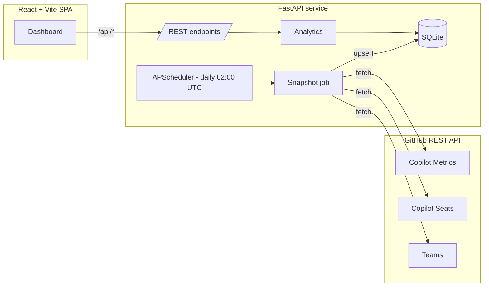

# copilot-usage-review

Executive dashboard that pulls GitHub Copilot usage for the `Juniper-SSN`
org, accumulates a rolling history beyond GitHub's 28-day API window, and
surfaces ROI, adoption health, stale-seat reclaim candidates, team
leaderboards, and 90-day projections.

## Prerequisites

- Docker + Docker Compose (recommended)
- Or: Python 3.12 with [`uv`](https://docs.astral.sh/uv/) + Node.js 20 for local dev
- A GitHub PAT (classic or fine-grained) with:
  - `manage_billing:copilot` (Copilot metrics + seats)
  - `read:org` (teams, team members, repos)
  - `repo` (PR detail ingestion across private repos)
  - **Enhanced billing** access: classic `manage_billing:enterprise` /
    `manage_billing:copilot` or fine-grained **Plan: Read** on the org
    (for per-user AI-credit rollups via the enhanced-billing API)
- Org admin role on the target GitHub organization

## Quick Start

```bash
cp .env.example .env
# Edit .env and set GITHUB_TOKEN (+ adjust GITHUB_ORG / SEAT_COST_USD as needed)
docker compose up --build
```

Open <http://localhost:8080>. The first snapshot runs in the background
shortly after the backend starts; click **Refresh snapshot** to force one.
Use **Import file** to load a local GitHub Copilot usage export or
billing CSV report instead of calling the Copilot Metrics API.

## Local Development

### Backend

```bash
cd backend
uv venv --python 3.12 .venv
uv pip install -r requirements.txt
uv pip install pytest pytest-asyncio ruff mypy
.venv/bin/python -m pytest
.venv/bin/python -m uvicorn app.main:app --reload --port 8000
```

### Frontend

```bash
cd frontend
npm install
npm run dev   # http://localhost:5173, proxies /api to :8000
```

## Architecture



The GitHub Copilot Metrics API only retains the last 28 days. The
snapshot job runs daily, upserting any new days into SQLite, so the
local store grows past 28 days over time toward the 90-day exec view.

## Configuration

All settings come from environment variables (or a local `.env`).

| Variable | Default | Description |
|----------|---------|-------------|
| `GITHUB_TOKEN` | *(required)* | PAT with `manage_billing:copilot` + `read:org` |
| `GITHUB_ORG` | `Juniper-SSN` | Target organization login |
| `GITHUB_ENTERPRISE` | `juniper-net` | Enterprise slug used as a fallback for org-scope 404s (metrics + billing usage). Empty to disable. |
| `SEAT_COST_USD` | `39.0` | Per-seat monthly cost used for ROI math |
| `MINUTES_SAVED_PER_ACCEPTANCE` | `0.5` | Benchmark for hours-saved estimates |
| `STALE_SEAT_DAYS` | `30` | Inactivity threshold for "stale" seats |
| `SNAPSHOT_TIME_UTC` | `02:00` | Daily snapshot cron time (`HH:MM`, UTC) |
| `DB_PATH` | `/data/copilot.db` | SQLite file location |
| `CORS_ALLOW_ORIGINS` | `["http://localhost:5173"]` | JSON list of allowed frontend origins |
| `PR_INGEST_ENABLED` | `true` | Ingest PR activity for the Users / Quality tabs |
| `PR_LOOKBACK_DAYS` | `120` | How far back to walk repos for PRs |
| `PR_MAX_REPOS` | `300` | Cap on repos scanned per snapshot |
| `PR_CONCURRENCY` | `4` | Parallel PR-detail fetches |
| `PR_INCLUDE_FORKS` | `false` | Whether forked repos count |
| `PR_INCLUDE_ARCHIVED` | `false` | Whether archived repos count |
| `SEED_MODE` | `false` | Disables snapshots when synthetic seed data is in use (see Fake-Data Mode) |
| `IMPORT_MAX_UPLOAD_MB` | `25` | Max size for local `.json`, `.jsonl`, `.ndjson`, or `.csv` usage imports |

## Local Usage Imports

The dashboard can load local GitHub Copilot usage files without a
browser-supplied token. Supported formats:

- `.json`: array of Copilot Metrics API day records, or array of GitHub
  per-user-per-day export rows.
- `.jsonl` / `.ndjson`: one GitHub per-user-per-day export row per line.
- `.csv`: a GitHub billing usage report. Two schemas are recognized
  (see [CSV billing reports](#csv-billing-reports) below).

Import workflow:

1. Obtain the export from GitHub outside this app.
2. Open the dashboard and click **Import file** beside **Refresh snapshot**.
3. Select a supported local file. The backend validates extension and
   upload size, skips malformed NDJSON lines with warnings, and imports
   valid rows.
4. The dashboard refreshes current views and the header shows the
   unified last data load source (`api`, `json_import`,
   `csv_ai_usage_report`, or `csv_usage_report`).

Imports are idempotent at org/date scope. Re-importing the same file
upserts the org daily row and replaces language, editor, and model rows
for matching dates, so duplicates are not created.

### CSV Billing Reports

CSV imports route exclusively into the billing-usage store and feed the
cost and AI-credit views. They never synthesize activity telemetry
(suggestions, acceptances, active/engaged users, languages, editors).
The schema is detected automatically from the header row:

- **AI usage report** (`csv_ai_usage_report`) — per-user, per-date,
  per-model Copilot AI-credit billing rows. Detected by a `Model` column.
  Example filename: `AIUsageReport_2026-06.csv`. Populates the
  AI-credit totals, top users, and the per-user by-model breakdown
  (the breakdown prefers the CSV `Model` column over parsing the SKU).
- **General usage report** (`csv_usage_report`) — general GitHub billing
  rows that may span Actions, storage, Copilot AI credits, and other
  products. Detected by a `Workflow Path` and/or `Product` column.
  Example filename: `usageReport_2026-06.csv`. Only Copilot rows surface
  in Copilot cost/premium rollups; non-Copilot products (Actions,
  storage, …) are stored but excluded from Copilot summaries.

CSV handling details:

- Headers are matched case-insensitively and order-independently; common
  Title Case spellings (e.g. `Unit Type`, `Gross Amount`,
  `Total Monthly Quota`) are normalized to their canonical fields.
- A leading UTF-8 BOM is stripped automatically.
- Blank or non-numeric amount/quantity cells import as `0` with a
  bounded warning rather than failing the import.
- Rows missing a usable `Date` are skipped and reported in `skipped_rows`.
- CSV imports use a partial upsert keyed by
  `(date, login, sku, repository, model, workflow_path)`, so model- and
  workflow-specific rows stay distinct, re-imports are idempotent, and
  billing rows from other dates or sources are left untouched.
- An unrecognized CSV (missing the required `Date`/`SKU`/`Quantity`
  columns and any schema marker) is rejected with a `400` listing the
  columns that were found.

Source caveats:

- API-shaped JSON day arrays reuse the same normalization as snapshots.
- Per-user export rows are aggregated to org/day metrics. Active users
  are distinct users with any interaction or usage flag; engaged users
  are distinct users with generation or acceptance activity.
- `code_completion` maps to inline/code suggestions and acceptances.
  Chat panel, agent, and CLI features map to chat-like model/editor
  usage where export breakdowns are present.
- `loc_suggested_to_add_sum` maps to lines suggested and
  `loc_added_sum` maps to lines accepted.
- Raw source rows are preserved in `raw_json` for traceability.
- JSON/NDJSON imports do not invent team metrics, seat data, billing
  usage, AI credits, PR data, or per-user Copilot metrics when the
  export lacks those sources. CSV billing imports, conversely, populate
  only billing/cost views and do not invent activity telemetry, teams,
  seats, or PR data. Related dashboard views show empty or unavailable
  states.

### Upload Size Limits

Two limits apply to uploads; keep them aligned:

- **Backend** — `IMPORT_MAX_UPLOAD_MB` (default `25`) is the authoritative
  cap and returns a clean JSON `413` when exceeded.
- **Reverse proxy** — in the containerized frontend, nginx
  (`frontend/nginx.conf`) sets `client_max_body_size 50m`. If this is
  lower than your file, nginx returns `413 Request Entity Too Large`
  before the request reaches the backend. Raise it to at least
  `IMPORT_MAX_UPLOAD_MB` if you increase the backend cap.


All windowed endpoints accept either `?days=N` **or** an explicit
`?start=YYYY-MM-DD&end=YYYY-MM-DD` range (explicit range wins).

| Method | Path | Returns |
|--------|------|---------|
| GET | `/api/health` | Liveness + last snapshot time |
| GET | `/api/kpis` | Headline KPI strip (incl. window cost + AI-credit slot) |
| GET | `/api/trends` | Daily org metrics |
| GET | `/api/teams` | Per-team leaderboard |
| GET | `/api/teams/list` | Lightweight team list for the Teams tab |
| GET | `/api/teams/{slug}` | Team detail (KPIs, models, chat-vs-inline, PR correlation, AI credits) |
| GET | `/api/users` | User roster with status (`active` / `stale` / `never_used`) + PR rollup |
| GET | `/api/users/{login}` | User detail (PR activity, seat lifecycle, AI credits) |
| GET | `/api/models` | Model usage breakdown (org or per team) |
| GET | `/api/chat-vs-inline` | Chat-vs-inline interaction share |
| GET | `/api/cost` | Prorated dollar cost for the selected window |
| GET | `/api/cohorts` | Seat onboarding-ramp buckets + median days-to-first-use |
| GET | `/api/distribution` | Power-user concentration (top-10% share, median, top contributors) |
| GET | `/api/pr-correlation` | AI vs non-AI PR metrics (merge rate, cycle time, size, review load) |
| GET | `/api/quality` | One-shot rollup powering the Quality tab |
| GET | `/api/ai-credits` | Org AI-credit totals + SKU breakdown + top users |
| GET | `/api/ai-credits/users/{login}` | Per-user daily AI credits + SKU breakdown |
| GET | `/api/ai-credits/teams/{team_slug}` | Team rollup of member AI-credit usage |
| GET | `/api/seats/stale` | Reclaim candidates |
| GET | `/api/breakdowns` | Language + editor breakdowns |
| GET | `/api/roi` | Cost / savings summary |
| GET | `/api/projections` | 90-day trajectory + seat right-sizing |
| POST | `/api/snapshot/run` | Trigger an immediate snapshot |
| POST | `/api/data/import-file` | Multipart upload for local `.json`, `.jsonl`, `.ndjson`, or `.csv` Copilot usage/billing imports |
| GET | `/api/data/export` | Download the entire database as one gzip-compressed SQLite file |
| POST | `/api/data/import-db` | Multipart upload of a database export; `?mode=replace\|merge` |

### Import Endpoint

`POST /api/data/import-file` accepts multipart form-data with a required
`file` part. Unsupported suffixes return `400`; files larger than
`IMPORT_MAX_UPLOAD_MB` return `413`; completely invalid files return
`400`. Malformed NDJSON lines are skipped and reported in `warnings`
when at least one valid row imports.

Example response:

```json
{
  "source_type": "github_export_ndjson",
  "rows_read": 42,
  "rows_imported": 40,
  "skipped_rows": 2,
  "warnings": ["line 7: invalid JSON skipped (Expecting value)"],
  "date_range": { "start": "2026-06-01", "end": "2026-06-16" },
  "overwritten": [{ "date": "2026-06-15", "scope": "org" }],
  "imported_at": "2026-06-17T12:00:00+00:00"
}
```

### Full-Database Export / Import

Use **Export data** (beside **Import file**) to download the whole store as a
single `copilot-usage-export-<timestamp>.db.gz` file — a gzip-compressed SQLite
database. This is a portable, efficiently packed backup of every table.

The **Import file** button also accepts a database export. When it detects one
(by extension: `.db`, `.sqlite`, `.sqlite3`, or any of these plus `.gz`), it
prompts whether to:

- **REPLACE** — wipe every shared table, then load the export's rows.
- **MERGE** — upsert the export's rows on top of existing data (existing keys
  are overwritten, new keys added, untouched rows kept).

Only columns present in **both** the current schema and the uploaded export are
copied, so exports from an older schema still import cleanly. Export/import is
driven by `GET /api/data/export` and `POST /api/data/import-db?mode=replace|merge`.
The import endpoint returns the mode and post-import row count per table:

```json
{
  "source_type": "db_export",
  "mode": "merge",
  "tables_imported": 8,
  "rows_total": 124301,
  "tables": { "billing_usage": 98231, "pull_requests": 2036 }
}
```

### Tabs

- **Summary** — original exec view + window cost + AI-credit slot.
- **Teams** — pick a team to drill into KPIs, model mix, chat-vs-inline,
  PR correlation, and AI-credit usage by member.
- **Users** — filter by `active` / `stale` / `never_used`; per-user view
  shows PR activity, seat lifecycle, daily AI credits, recent PRs.
- **Quality** — chat-vs-inline, model breakdown, power-user concentration,
  cohort ramp, PR correlation, and org AI-credit usage with SKU
  breakdown and top users.

### Data Availability Notes

- **Tokens:** GitHub does not expose per-user or per-org Copilot token
  counts in any API. The dashboard surfaces AI-credit counts (a
  proxy for chat / agent intensity) instead and labels token fields as
  unavailable. Do not infer tokens from AI credits.
- **Per-user Copilot metrics:** the Copilot Metrics API is org-aggregate
  only — no per-user model / language / acceptance data. The Users tab
  surfaces seat lifecycle + PR activity as the best available proxy.
- **AI credits:** sourced from the enhanced-billing API
  (`/organizations/{org}/settings/billing/usage`). Requires the
  Enhanced Billing Platform on the org and a token with `Plan: Read`.
  If unavailable, the UI shows an empty state with a clear message.

### Glossary

Every KPI card in the UI has a hover tooltip (ⓘ) explaining its formula
and data source. Common terms:

| Term | Definition |
|------|------------|
| **DAU** | Daily Active Users — distinct users in the org with any Copilot IDE telemetry event (completions or chat) on a given day. From `total_active_users` in the Copilot Metrics API. |
| **avg_dau_7d** | Mean DAU over the last 7 days of the window. |
| **Acceptance rate** | `total_code_acceptances / total_code_suggestions`, summed across every editor / model / language for each day in the window. |
| **Engaged users** | Subset of active users who triggered a Copilot suggestion (vs just having Copilot loaded). Always ≤ DAU. |
| **Adoption (30d)** | `active_users_30d / total_seats`. Users qualify as active if `seat.last_activity_at` is within the window. |
| **Window cost** | Prorated seat cost over the selected window. Per-seat days inside the window × `(SEAT_COST_USD / 30)`. Excludes pending-cancellation days. |
| **Hours saved (est.)** | `acceptances × MINUTES_SAVED_PER_ACCEPTANCE / 60`. A tunable benchmark, not a measured value. |
| **AI-touched PR** | Pull request whose author currently holds a Copilot seat. The closest available proxy — GitHub does not surface per-line AI attribution. |
| **AI credit** | A billable Copilot interaction (e.g. chat, agent, code review) measured in credits (1 credit = $0.01 USD) and recorded by the enhanced-billing API. Not the same as tokens. |
| **Stale seat** | Seat with no activity in the last `STALE_SEAT_DAYS` days. Reclaim candidate. |
| **Top-10% share** | Share of total PRs written by the top decile of authors. 100% = one author wrote everything; 10% = perfectly even. |

## Testing

```bash
cd backend && .venv/bin/python -m pytest
```

Coverage focus: pure functions (`_flatten_languages`, `_flatten_editors`,
`_normalize_seat`, `_linreg`), the local file importer, and the
analytics layer backed by a temp SQLite fixture.

## Data Reset

If you distrust accumulated data after schema changes or need a clean slate
for reimporting, use the reset script:

```bash
cd backend && .venv/bin/python -m scripts.reset_data
```

The script resolves the DB path in this order:

1. `--db-path` (if provided)
2. `DB_PATH` / app settings
3. Local fallback paths (`backend/data/copilot.db`, then `data/copilot.db`)

Examples:

```bash
# Explicit path
cd backend && .venv/bin/python -m scripts.reset_data --db-path data/copilot.db

# Or via env
cd backend && DB_PATH=data/copilot.db .venv/bin/python -m scripts.reset_data
```

This deletes all data rows while preserving the schema, so the app can
re-populate via:

- Daily snapshot job (normal operation via GitHub API)
- **Import file** (CSV, JSON, NDJSON)
- **Refresh snapshot** (force immediate API snapshot)
- `scripts.seed_test_data` (synthetic test data for preview)

## Fake-Data Mode (UI Preview Without a PAT)

If you don't yet have a GitHub PAT with Copilot enterprise / billing
access, you can populate the SQLite store with realistic synthetic data
to validate the entire UI end-to-end. The seeder generates ~90 days of
org + per-team metrics, ~120 days of PRs, 45 seats split across active /
stale / never-used cohorts, and per-user AI-credit rows.

```bash
cd backend
.venv/bin/python -m scripts.seed_test_data

# Boot the backend with SEED_MODE=true so the daily snapshot job
# doesn't overwrite the synthetic data.
SEED_MODE=true \
  DB_PATH=$PWD/data/copilot.db \
  .venv/bin/python -m uvicorn app.main:app --reload --port 8000

# In another shell:
cd frontend && npm run dev
```

`SEED_MODE=true` disables the boot snapshot, the daily cron, and the
`POST /api/snapshot/run` endpoint (which returns `409`) so the seeded
rows stay put. Re-run the seeder any time to reset.

## Security Notes

- Secrets are environment-only; never committed (`.env` is in `.gitignore`).
- CORS defaults to a tight allowlist; override via `CORS_ALLOW_ORIGINS`.
- The backend does not expose the GitHub PAT to the browser — all
  GitHub calls happen server-side.
- The dashboard has no auth out of the box. Run it on a trusted network,
  or front it with an authenticating reverse proxy before exposing it.

## Decisions

- [`docs/adr/0001-stack-and-architecture.md`](docs/adr/0001-stack-and-architecture.md)

## Contributing

This repo uses the [ai-keel](https://github.com/Juniper-SSN/ai-keel)
agent customization framework. Routing files live under `.github/`,
`.claude/`, and `CLAUDE.md`. Run `ai-keel sync` after changes.

## License

Internal — Juniper Networks.

---

**Version:** 2026-06-24

History collected:
- 2026-06-24: Data reset script, version tracking added; seat filtering, PR activity reorganization, AI-credits rendering fixes
- 2026-06-04: Last comprehensive review
